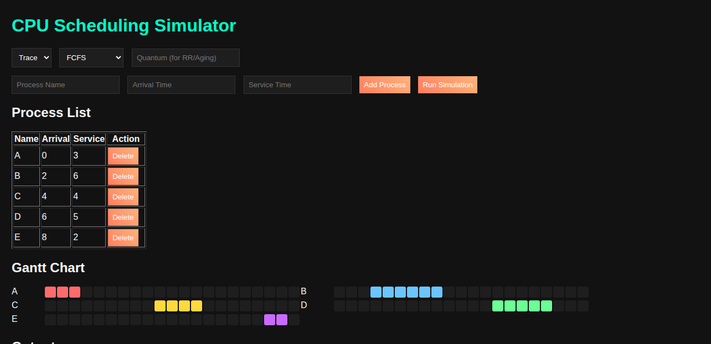
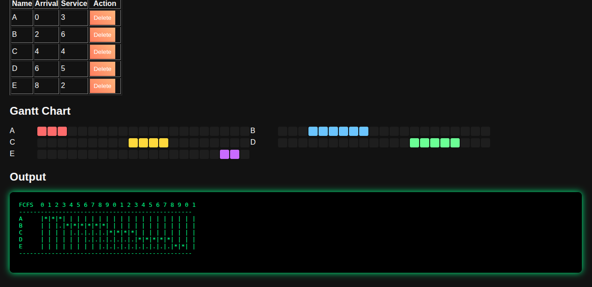
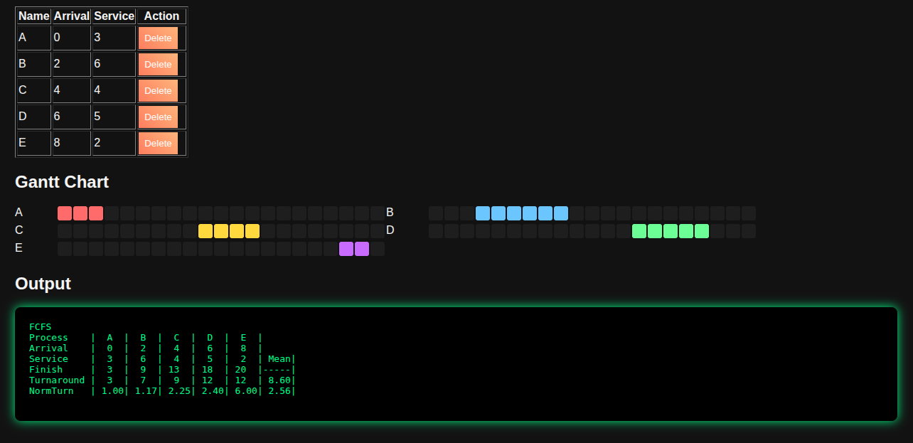
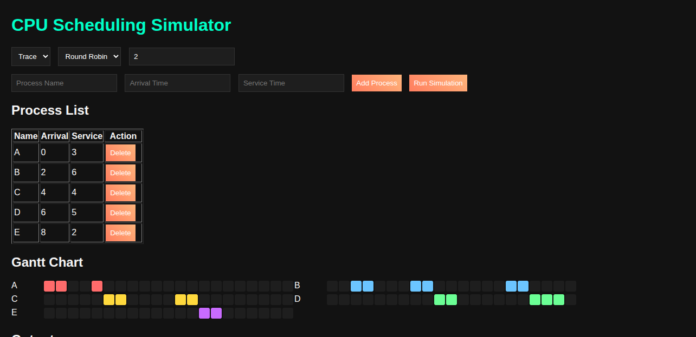

# CPU Scheduling Simulator (Web Version)

An interactive **web-based simulator** for various CPU scheduling algorithms. Users can input processes, select scheduling strategies, and visualize execution with **Gantt charts**, along with statistics like waiting time, turnaround time, and CPU utilization. Built with **HTML, CSS, JavaScript**, and **Node.js** for backend processing.

---

## Table of Contents

- [Features](#features)
- [Supported Algorithms](#supported-algorithms)
- [Installation](#installation)
- [Usage](#usage)
- [Input Format](#input-format)
- [Contributors](#contributors)

---

## Features

- Web interface to **input processes and parameters** easily.
- Supports **multiple algorithms simultaneously** for comparison.
- Interactive **Gantt chart visualization** of CPU scheduling.
- Shows **statistics**: waiting time, turnaround time, and CPU utilization.
- Switch between **trace mode** (step-by-step execution) and **stats mode**.

---

## Supported Algorithms

- **First Come First Serve (FCFS)** – Non-preemptive, executes processes by arrival order.
- **Round Robin (RR)** – Preemptive with configurable time quantum.
- **Shortest Process Next (SPN)** – Non-preemptive, executes shortest burst time first.
- **Shortest Remaining Time (SRT)** – Preemptive, executes process with least remaining time.
- **Highest Response Ratio Next (HRRN)** – Non-preemptive, chooses process with highest response ratio.
- **Feedback (FB)** – Multi-level feedback queues with priority levels.
- **Feedback with Varying Quantum (FBV)** – FB with adjustable time quanta.
- **Aging** – Avoids starvation by gradually increasing waiting process priorities.

---

## Screenshots

### CPU Scheduling Simulation

